# Atlas Gym

## Table of Contents

### UX Design
* Project Goals
* Design Choices
* User Stories
* Wireframes

### Features
* Existing Features
* Features to be implemented
### Technologies Used
### Testing
### Deployment
### Credits
* Content
* Media
* Code
* Acknowledgements

## UX Design

### Project Goals
My main goal from this project is to provide a clean and appealing website for Atlas Gym in order to provide information for current gym members and also aspiring gym members, whether for personal or class related activities.

The user goals are:
* To receive information about the gym's current facilities and upcoming facilities through text and images.
* Information and details about potential classes, including the respective date, time and area they are taking place in.
* An easy to navigate interface with certain pages being accessible by the top navigation system and buttons.

The developer goals are:
* Interest in retaining the gym's current members through the use of fresh site structure.
* Interest in attracting fresh members to the gym and its facilities through the use of appealing imagery, video and layout.

### User Stories
As a current and long time member of Atlas Gym, I want:
* The site to bring a brand new and fresh feel to the gym and its facilities.
* Easy to find info on new facilities or classes that they may have not been aware of.
* Ease of finding out vital things such as change in membership prices or class schedules.

As a new member of Atlas Gym, I want:
* Ease of access around the site, so that it is simple to know where specific things are. 
* A clear and simplified navigation system seperating each part of the gym into its own page.
* Images of current gym members and equipment that are motivational towards me becoming a member.
* Multiple ways of contact information for if I am interested in joining the gym.

### Design Choices

#### Font
* I have used the default Bootstrap font throughout the site because it is clear, simplistic and not too flashy, relating to keeping the website as minimalistic as possible.

#### Icons
* I have utilised social media icons at the footer of the site for Facebook, Instagram and Twitter as they are recognisable by anyone as the main social media platforms.
* These are accessible at the bottom of every page, so the user can access it from anywhere.

#### Colours
* The site was kept mainly very monochrome to keep it easy on the viewer's eye and to make any colourful images that were implemented to stand out.

#### Styling
* Partly transparent containers were the main style feature of the site, and helped it look box-structured on pages where there was lots of info.

#### Background
* The background of the site was black and white and therefore set the tone for the rest of the colours to be used for it. It was a fixed background also, and gave some parts of the site a moving feel when scrolling.

### Wireframes
My initial wireframes were simplified ideas about each page of the site, though more features have been added to the live project since creating them. For example, the testimonials section on the facilities page and the membership tab on the home page.
* Home (Desktop)
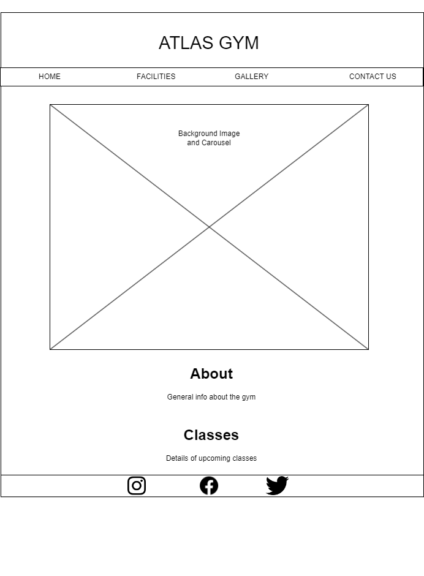
* Home (Tablet)
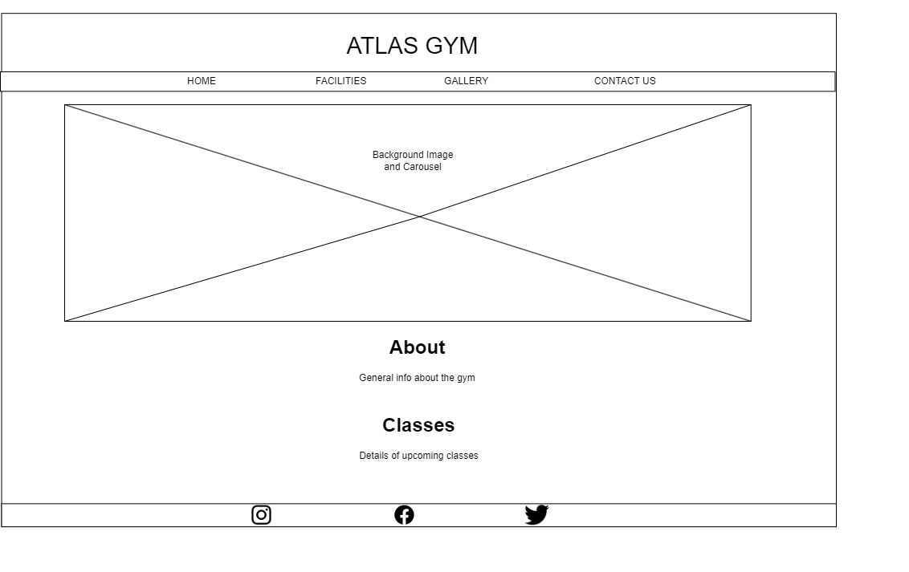
* Home (Mobile)
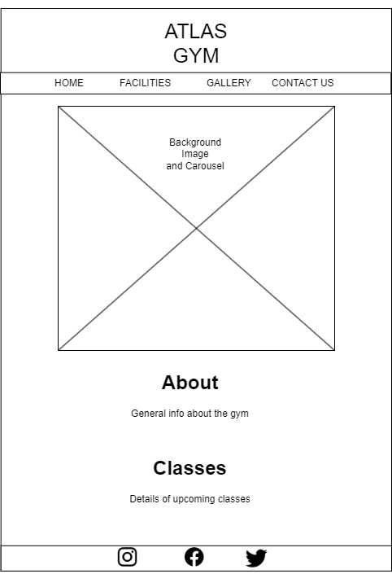
* Facilities (Desktop)
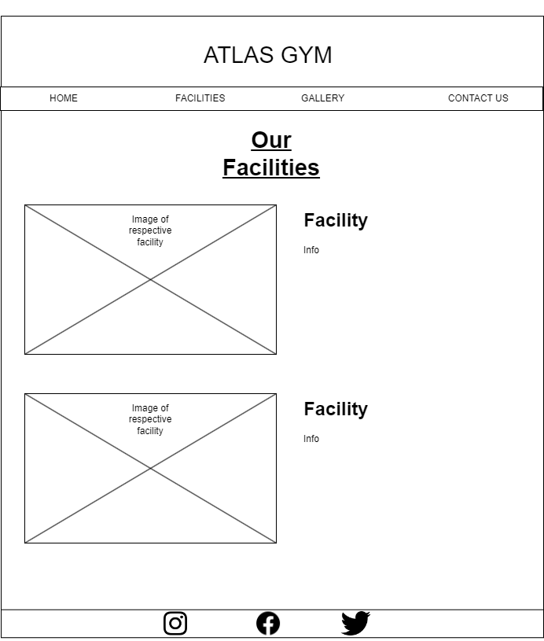
* Facilities (Tablet)
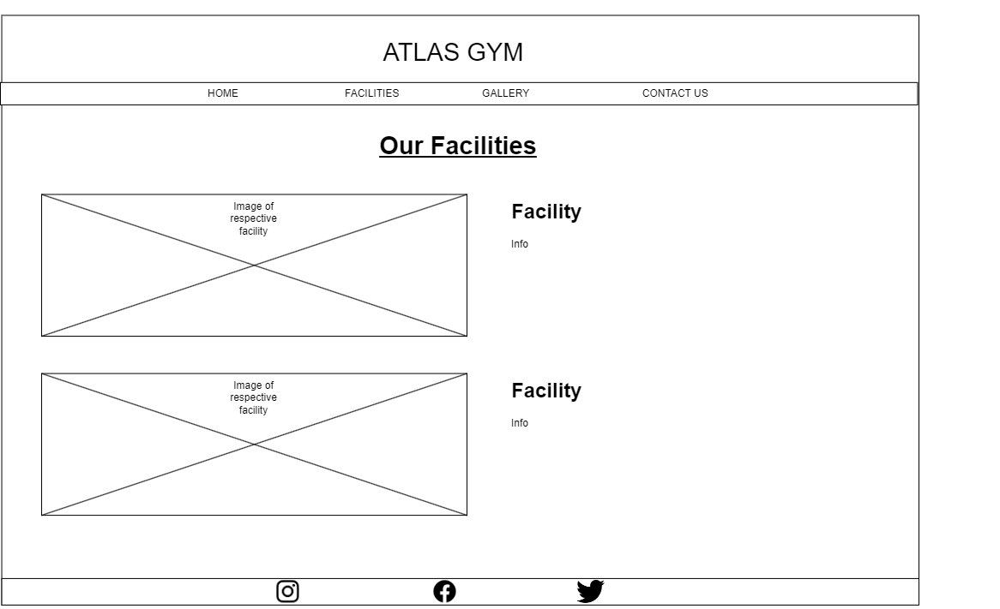
* Facilities (Mobile)
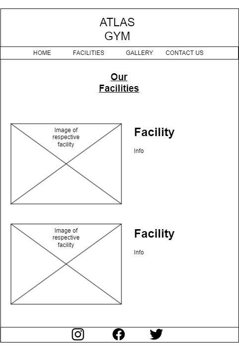
* Gallery (Desktop)
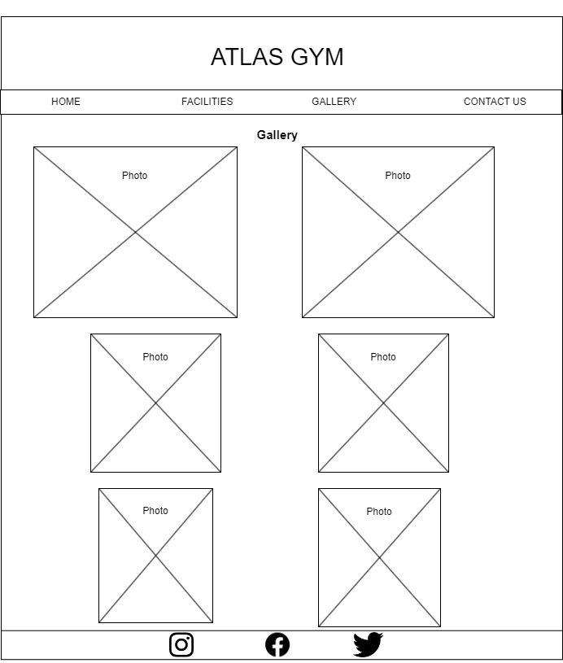
* Gallery (Tablet)
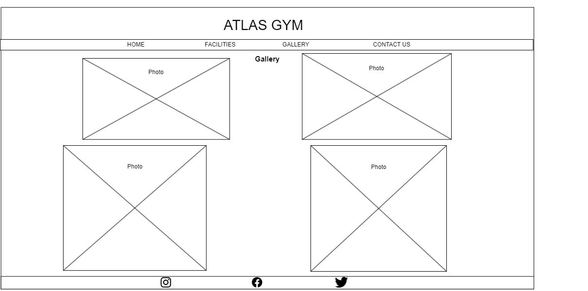
* Gallery (Mobile)
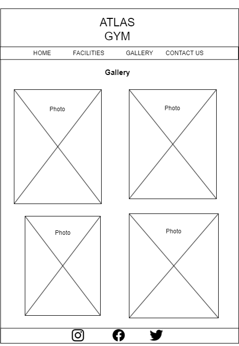
* Contact Us (Desktop)
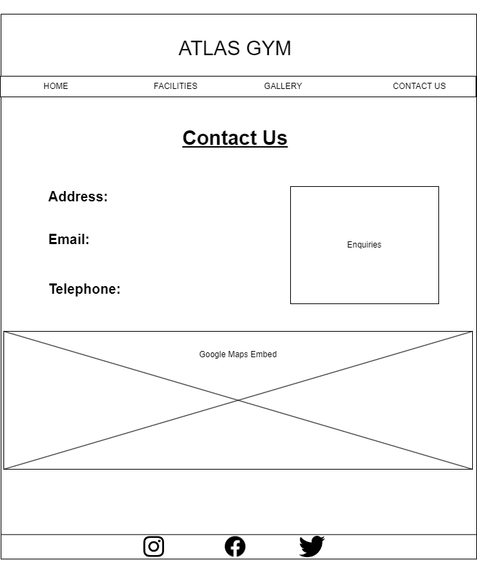
* Contact Us (Tablet)

* Contact Us (Mobile)
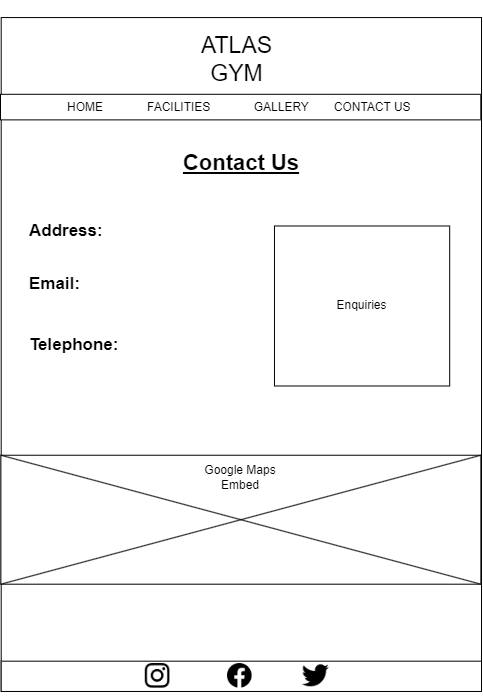

## Features

### Existing Features
* Navigation System
* Testimonials 
* Video/Images
* Buttons
* Enquiry Form
* Social Media Footer
* Google Maps Embed

### Features to be implemented
* Implement a login system for site admins and staff.
* Migrate the membership container on the home page to its own new page, alongside a sign up form and potential payment system.

## Technologies Used
* HTML
* CSS
* Bootstrap v4.0

## Testing
### Testing User Stories
1. Easy to find info on new facilities or classes that they may have not been aware of
    * The navigation bar, which is at the top of all pages, has a **Facilities** page where all of this info is stored.
    * The **Home** page has a **Classes** container towards the bottom with details on upcoming classes, as well as a button linking to the **Facilities** page.
2. Multiple ways of contact information for if I am interested in joining the gym.
    * The **Home** page contains some brief contact info underneath the welcoming title, such as opening times and address.
    * The **Contact Us** page has many forms of contact information, with an enquiry box, Google Maps embed, telephone number and extended opening hours.
3. Images of current gym members and equipment that are motivational towards me becoming a member.
    * The carousel element on the **Home** page contains photos of some of the gym's facilities.
    * The **Facilities** page possesses lots of photos and even a video that stand out against the dark background.
    * The **Gallery** page has two columns of pictures consisting of current gym members working out for motivation.
4. Ease of finding out vital things such as change in membership prices or class schedules.
    * The **Home** page contains all of this information as it is important, both the membership prices and upcoming classes are contained in their own seperate box 
5. A clear and simplified navigation system seperating each part of the gym into its own page.
    * The navigation bar clearly seperates all aspects of the gym into 4 seperate pages, 'Home', 'Facilities', 'Gallery' and 'Contact Us', each with their specific area to focus on.

### Site Checks

<!-- Expected
Testing
Result
Fix(?) -->
used z-index for collapsed nav bar to make sure images weren't overlapping it on mobile devices

### Bugs
* The container of the top navigation bar seems to extend when hovering over a page option.

## Deployment
This project was developed using Visual Studio Code IDE with commits to git and pushed to GitHub using Source Control.

To deploy this page to GitHub Pages, these steps were taken:
1. Log into GitHub
2. Select repository **"jarough/Atlas-Gym"**
3. Click on settings at the top of repository page
4. Find the GitHub Pages section
5. Under **Source** select the branch 'Master Branch' instead of 'None'
6. The page is refreshed and the website is now live.

To clone this project:
1. Follow the [link](https://github.com/jarough/Atlas-Gym) to the repository
2. Click on the green **Code** button above the file list
3. Make sure **HTTPS** is highlighted and copy the link below it
4. Open Git Bash
5. Change the working directory to the location you want the cloned directory
6. Type 'git clone' followed by the URL you copied
7. Press **Enter** to create the clone.

## Credits

### Content & Media
* The images and videos found around the site were sourced from:

    * [Unsplash](https://unsplash.com/)
    * [Pixabay](https://pixabay.com/)
    * [Pexels](https://pexels.com)
    * [Video](https://www.pexels.com/video/personal-trainer-helping-man-stretching-6111026/) by Kampus Production on [Pexels](https://pexels.com)
    * Image by <a href="https://pixabay.com/users/wanderercreative-855399/?utm_source=link-attribution&utm_medium=referral&utm_campaign=image&utm_content=973460">Stephanie Edwards</a> from <a href="https://pixabay.com//?utm_source=link-attribution&utm_medium=referral&utm_campaign=image&utm_content=973460">Pixabay</a>
    * Background Photo by <a href="https://unsplash.com/@risennnnn?utm_content=creditCopyText&utm_medium=referral&utm_source=unsplash">Risen Wang</a> on <a href="https://unsplash.com/photos/gym-equipment-inside-room-20jX9b35r_M?utm_content=creditCopyText&utm_medium=referral&utm_source=unsplash">Unsplash</a>
  
### Code
* Code for the base carousel taken and modified from [W3Schools](https://www.w3schools.com/bootstrap4/bootstrap_carousel.asp) and inspiration taken from the [Bootstrap](https://getbootstrap.com/docs/4.1/components/carousel/) documentation.
* Code for alerts modified from [W3Schools](https://www.w3schools.com/bootstrap4/bootstrap_alerts.asp).
* Code for the top navigation bar modified from [W3Schools](https://www.w3schools.com/bootstrap4/bootstrap_navbar.asp).
* CSS code for changing the navbar toggler on mobile devices from this [StackOverflow](https://stackoverflow.com/questions/76532056/bootstrap-navbar-toggler-icon-wont-change-color) post.
* Help with the div classes for the video element in this [StackOverflow](https://stackoverflow.com/questions/26040136/bootstrap-3-responsive-mp4-video) post.
* Code for photos on gallery page taken and modified from [W3Schools](https://www.w3schools.com/howto/howto_css_image_grid_responsive.asp).
* Code for the input enquiry box sourced from [W3Schools](https://www.w3schools.com/bootstrap/bootstrap_forms_inputs.asp).
