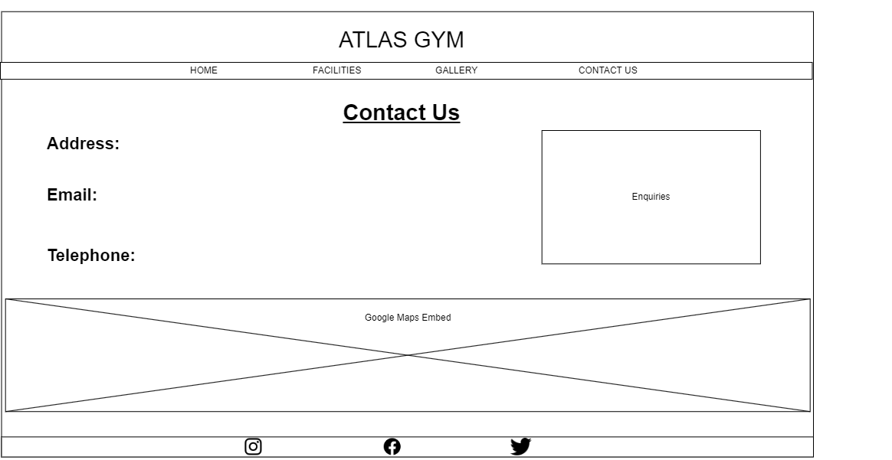

# Atlas Gym

## Table of Contents

### UX Design
* Project Goals
* Design Choices
* User Stories
* Wireframes

### Features
* Existing Features
* Features to be implemented
### Technologies Used
### Testing
### Deployment
### Credits
* Content
* Media
* Code
* Acknowledgements

## UX Design

### Project Goals
My main goal from this project is to provide a clean and appealing website for Atlas Gym in order to provide information for current gym members and also aspiring gym members, whether for personal or class related activities.

The user goals are:
* Information and images about the gym's current facilities and upcoming facilities.
* Information and details about potential classes, including the respective date, time and area they are taking place in.

The developer goals are:
* Interest in retaining the gym's current members.
* Interest in attracting fresh members to the gym and its facilities.

### Design Choices

I have chosen to keep social media links at the bottom of every page on a static bar so that users can access them no matter which page and where on the page they are.

### User Stories
For current or returning members of Atlas Gym, I want:
* 

For new members of Atlas Gym, I want:
* Images of gym equipment that are 
* A clear and simplified navigation system to find the page containing the information they require
* Images of current gym members that are motivational and inspire their attendance

### Wireframes
* Home 

* Facilities

* Gallery

* Contact Us

## Features

### Existing Features

### Features to be implemented

## Technologies Used
* HTML
* CSS
* Bootstrap v4.0

## Testing
used z-index for collapsed nav bar to make sure images weren't overlapping it on mobile devices

## Deployment

## Credits

### Content
### Media
### Code
### Acknowledgements

https://www.w3schools.com/bootstrap4/bootstrap_navbar.asp
https://www.w3schools.com/howto/howto_css_image_grid_responsive.asp
https://www.w3schools.com/bootstrap4/bootstrap_carousel.asp
https://www.w3schools.com/bootstrap/bootstrap_forms_inputs.asp
https://www.w3schools.com/bootstrap4/bootstrap_alerts.asp
https://getbootstrap.com/docs/4.1/components/carousel/
https://stackoverflow.com/questions/76532056/bootstrap-navbar-toggler-icon-wont-change-color
https://unsplash.com/

title navbar wasnt centering text; justify content center worked
changing color of navbar icon
bug: navbar moving when hovering over pages
